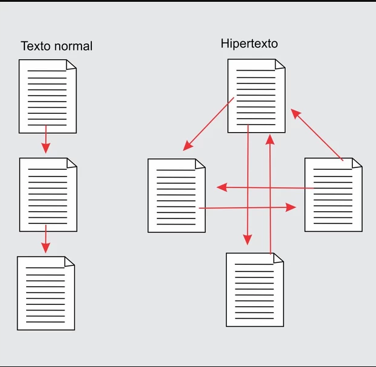

# Glossário de termos frequentemente usados

## Hipertexto

### Definição

#### Opção 1

A definição original de Theodor Nelson para o termo "hipertexto" foi apresentada por ele em 1965. Nelson cunhou o termo para descrever um **sistema de escrita não linear no qual os documentos estariam interconectados por links**.

#### Opção 2

Refere-se a um sistema de **organização e apresentação de informações em formato digital**, onde os elementos de informação estão **interconectados por meio de links** permitindo uma navegação não linear.

#### Exemplos

- Um livro online com links que levam a definições de palavras.
- Wikipedia: enciclopédia online que utiliza hipertexto extensivamente. Cada artigo contém links para outros artigos relacionados, permitindo que os leitores explorem tópicos de maneira mais abrangente.

