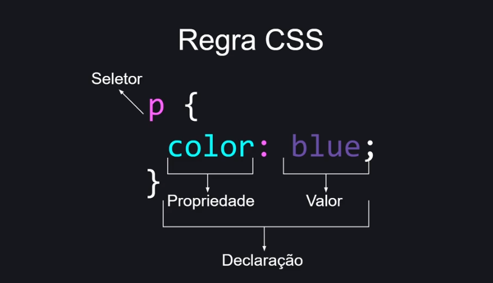

## Formas de utilizar css

1. inline
2. interna
3. externa

## Conhecendo a estrutura css



## Trabalhando com os tipos de seletores

1. Seletor de "tipo" ou elemento"

``` css
    p {
        color: blue;
    }
```

2. Seletor por classe

``` css
    .nomedaclasse {
        color: green;
    }
```

3. Seletor de id

``` css
    #nomedoid {
        color: blue;
    }
```

4. Seletor global

``` css
    * {
        color: purple;
    }
```

5. Seletor de descendente

``` css
    main h3 {
        color: blue;
    }
```

Busca todos h3 que estiverem dentro do main.
``` css
    main > h3 {
        color: blue;
    }
```
Só os h3 que estiverem diretamente aninhados (filho direto) com o mais terão essa regla aplicada.

## Trabalhando com os principais pseudos-seletores

``` css
    .exemplo:houver {
    background-color: #f00;
    }
```
houver - regra aplicada ao passar o cursor do mouse passar por cima do elemento

``` css
    .exemplo:focus {
    background-color: #f00;
    }
```
focus - quando o elemento estiver focado

``` css
    .exemplo:active {
    background-color: #f00;
    }
```

active - quando elemento for pressionado, clicado.

``` css
    li:firt-child {
    background-color: blue;
    }
```

firt-child: seleciona o primeiro elemento filho encontrado na página.

``` css
    li:last-child {
    background-color: red;
    }
```

last-child: seleciona o útimo seletor encontrado daquele elemento.

``` css
    li:nth-child(2) {
    background-color: red;
    }

    li:nth-child(odd) {
    background-color: green;
    }

    li:nth-child(even) {
    background-color: purple;
    }
```

nth-child(2): seleciona com base na posição que passamos, no caso 2.

nth-child(odd): posição ímpar
nth-child(even): posição par

## Criando pseudo-elemento CSS

pseudo-elemento ::

pseudo-classe :

``` css
.exemplo::after {
    content: " - Depois";
}

.exemplo::before {
    content: "Antes - ";
}

```

## Trabalhando com Cores

```css
    .exemplo-1{
        color = blue 
    }

    .exemplo-2{
        color = rgb(255,0,0)
    }

    .exemplo-3{
        color = #ff0000
    }
```

Ferramenta Color picker - auxiliar na escolha de cor

## Entendendo Unidades de medidas

como medir o __tamanho__ dos nossos elementos, espessura da __borda__ de um elemento, o tamanho  da __fonte__ e etc.

pixel - tamanha estático, fixa

``` css
.exemplo {
    width: 150px;
    height: 150px;
}
```

Porcentagem - unidade de medida flexivel. Tamanho relativo ao pai do elemento
``` css
.exemplo {
    width: 100%;
}
```

## Trabalhando com fontes

``` css
.texto {
    font-family: verdana, Arial, sans-serif;
} 
```

Melhor forma de usar fontes: fazendo importação dela no html.

Google fontes: tag link, colar dentro do head. copiar o que ele sugere que coloquemos no css.